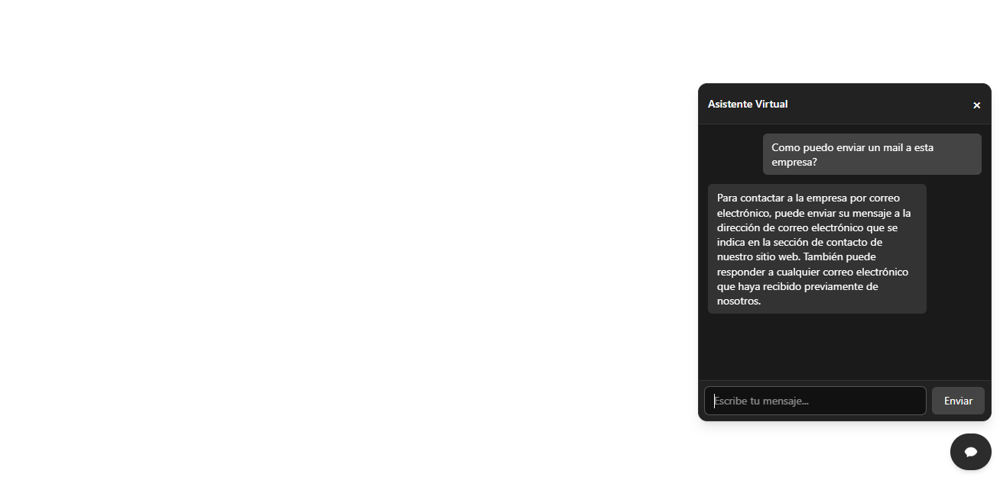

# 💬 Reusable AI Chat Widget - React Component

Este es un componente de chat completamente reutilizable en React que integra la API de **Gemini (Google)** para generar respuestas conversacionales tipo IA. Es ideal para agregar un asistente virtual o un agente conversacional en cualquier sitio web.

## 🧠 Características

- Componente 100% autocontenible y reutilizable.
- Estilo oscuro monocolor entre grises y negros.
- Diseño moderno, responsivo y minimalista.
- Botón flotante fijo abajo a la derecha para abrir/cerrar el chat.
- Animaciones CSS integradas (sin librerías externas).
- Soporte para `Escape` para cerrar el chat.
- Muestra notificaciones visuales si llega una respuesta mientras está cerrado.
- Spinner de carga mientras se espera respuesta.
- Prompt oculto para personalizar el comportamiento de la IA.

## 🖼️ Vista previa

 

## 🚀 Instalación

1. Copiá el archivo del componente (`ChatIA.jsx`) en tu proyecto.
2. Asegurate de tener configurado tu entorno con **Vite** o **React** con soporte para variables de entorno.
3. Agregá tu clave de API en un archivo `.env`:

```env
VITE_API_KEY=TU_API_KEY_DE_GEMINI
```

4. Importá y usá el componente en tu App:

```jsx
import ChatIA from './ChatWidget';

function App() {
  return (
    <>
      <ChatIA />
    </>
  );
}
```

## ✏️ Personalización

Dentro del componente, podés modificar el `const systemPrompt = "...";` para ajustar el comportamiento de la IA. Ejemplo:

```js
const systemPrompt = "Actúa como el asistente oficial de mi empresa, responde siempre de forma profesional y breve.";
```

## ⚙️ Requisitos

- React 18+
- API key de [Gemini (Google AI)](https://makersuite.google.com/app)
- TailwindCSS

## 📦 Tecnologías usadas

- React
- Fetch API
- Gemini 2.0 Flash API

## 📄 Licencia

Este componente está bajo licencia MIT. Usalo libremente en proyectos personales o comerciales.

---

Hecho con ❤️ por [Ivan Iraldi](https://iraldidev.vercel.app)

```
